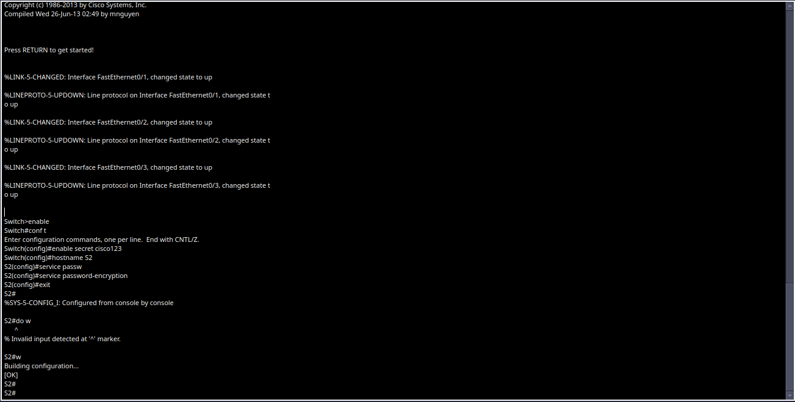
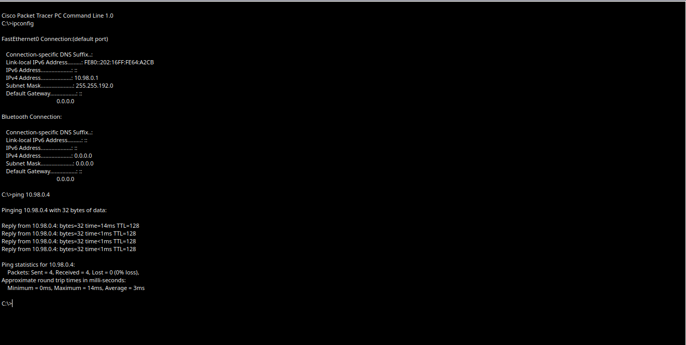

# hello
With my name bing Lukas Vachtl my x and y are
x = V (86) + a (97) + c (99) + h (104) + t (116) + l (108) = 610 = mod 610 =98
Y = L (76) + u (117) + k (107) + a (97) + s (115) = 512 = mod 10= 2

Pictures

